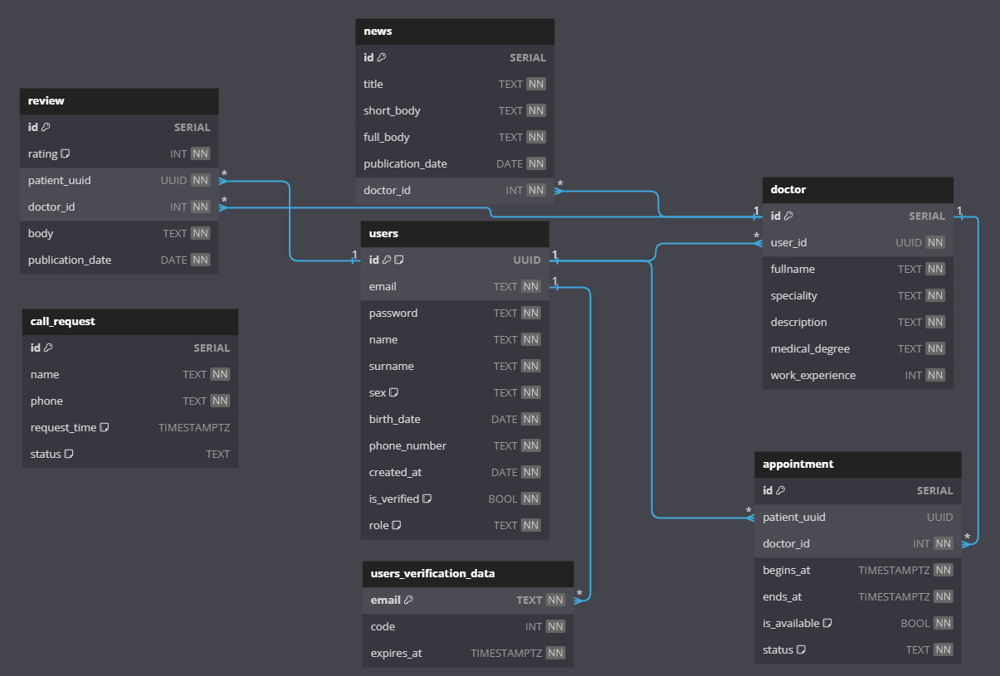

# АИС "Запись к врачу"

---

### Запуск программы

```bash
    ## Запуск backend:
    cd backend/app/cmd/app
    go run main.go
```

```bash
    ## Запуск frontend:
    cd frontend
    npm i --legacy-peer-deps
    npm start
```

```bash
    ## Запуск базы данных:
    docker compose  -f "docker-compose.yml" up -d --build db
```

Все миграции базы данных находятся в **backend/app/internal/dal/postgresql/migrations**

### Функционал:

* JWT регистрация и авторизация;
* Запись на прием к врачу пациентом;
* Изменение даты и времени записи на прием к врачу пациентом;
* Отмена записи к врачу пациентом;
* Оставление пациентом данных для обратной связи;
* Возможность чтения новостей с главной страницы сайта;
* Возможность отметить факт присуствия/неприсутсвия пациента на приеме к врачу;

### ER диаграмма физической модели базы данных:



### Полная документация, диаграммы и иллюстрации

Вся информация о проекте, включая 11 UML диаграмм, цель, функционал и подробные иллюстрации вариантов использования находятся в следующем Word-документе: [Скачать документ](./readme/documentation.docx)
